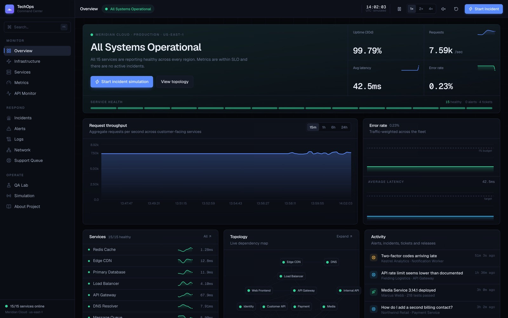
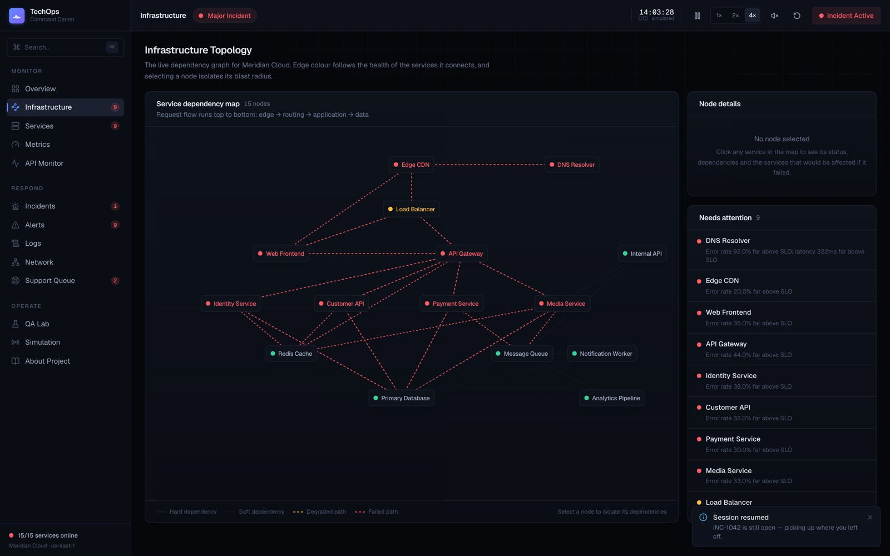
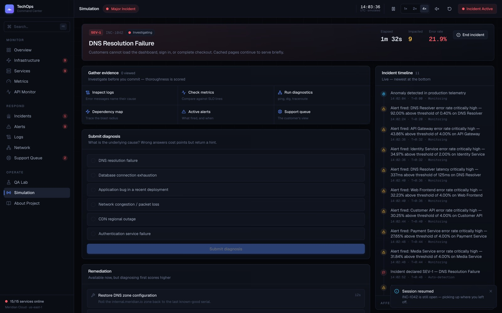
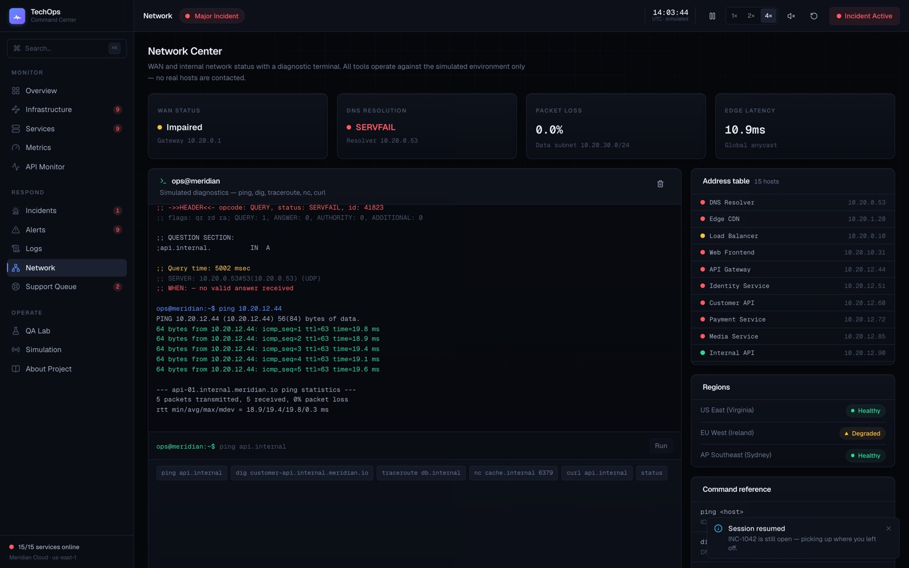
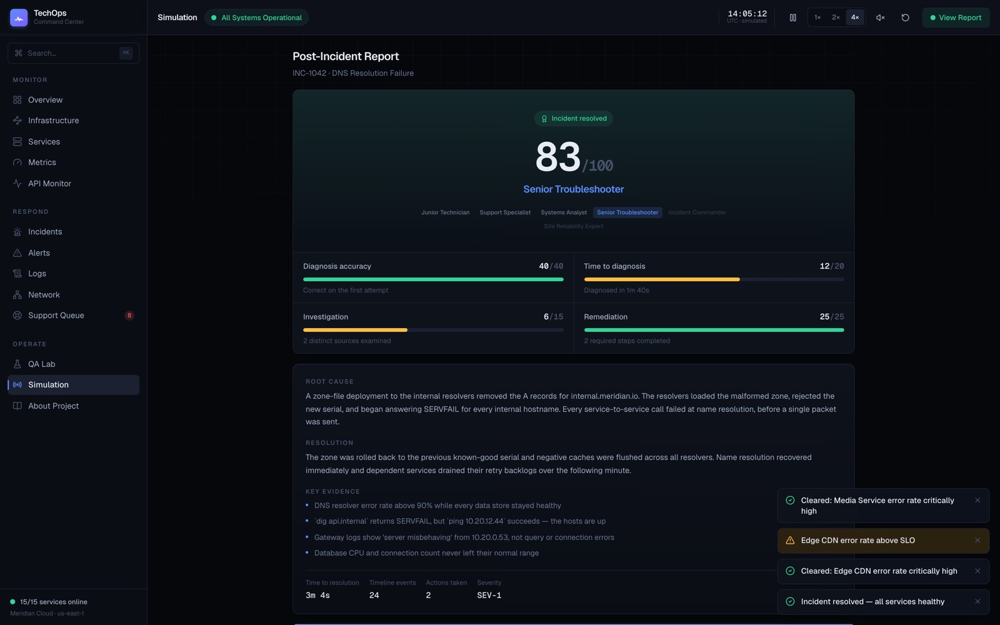

# TechOps Command Center

An interactive IT operations and incident-response simulator. Monitor a simulated
production infrastructure, trigger realistic incidents, investigate the evidence
across logs, metrics, topology and network diagnostics, commit to a root-cause
diagnosis, apply remediation, and restore service — scored on accuracy, speed,
thoroughness and restraint.

[](https://github.com/chadkraus87/techops-command-center/actions/workflows/ci.yml)

No account. No backend. No paid services. Open it and start clicking.

> **Meridian Cloud is fictional.** Every service, metric, log line, customer and
> ticket in this application is simulated. No real infrastructure is contacted.

---

**[▶ Try it live](https://techops-command-center.vercel.app/)** — no sign-up, no install. The
environment is already running.

---

## Screenshots

### Command Center
Global status, live charts and a per-service health strip. Everything on this screen is
computed from one metric layer, so no two panels can disagree.



### Infrastructure topology, mid-incident
A DNS failure in progress. Nine services are red — but Redis, Postgres and the message
queue are provably **green**, and that contradiction is what solves the scenario.



### Investigation workflow
Gather evidence, commit to a root cause, then remediate. A wrong diagnosis returns
scenario-specific coaching pointing at the evidence that rules it out.



### Network diagnostics
`ping` by hostname fails, `dig` returns SERVFAIL, but `ping` by IP succeeds — the hosts are
up, name resolution is not. Every command is answered from in-memory state.



### Post-incident report
Scored on accuracy, speed, thoroughness and restraint, with the full post-mortem and the
evidence that mattered.



> Screenshots are captured automatically against a production build by
> `node scripts/screenshots.mjs`, which drives a real incident end to end rather than posing
> a healthy dashboard.

---

## What it demonstrates

- **Systems thinking** — a coherent simulation where one root cause produces
  correlated symptoms across nine different views
- **Frontend engineering** — Next.js 16 App Router, React 19, TypeScript strict
  mode, a hand-built design system, and a responsive layout that reorganises
  rather than shrinks
- **Data visualisation** — live time-series, latency percentiles, sparklines and
  a dependency graph, all built to a consistent visual grammar
- **Operations knowledge** — SLO-derived alerting with evaluation windows,
  dependency cascades, tail-latency behaviour under saturation, and incident
  management workflow
- **Testing** — 105 unit tests over a pure, deterministic simulation engine, plus
  15 Playwright end-to-end tests across desktop and mobile

---

## Features

### Monitoring
- **Overview** — global status, uptime, throughput, latency, error rate, a
  per-service health strip, live activity feed and mini topology
- **Infrastructure** — interactive dependency map; selecting a node isolates its
  blast radius and shows exactly what would fail with it
- **Services** — catalogue of 15 services with owner, team, version, region,
  SLO, live metrics and sparklines
- **Metrics** — every metric channel a service reports, over 15m / 1h / 6h / 24h,
  with SLO reference lines
- **API Monitor** — per-endpoint p50/p95/p99, throughput, success rate, and
  inspectable recent requests with real response payloads

### Incident response
- **Simulation Center** — 8 scenarios with difficulty, severity and blast radius
- **Investigation** — gather evidence, submit a diagnosis, apply remediation
- **Incidents** — live timelines, affected services, root cause and post-mortem
- **Alerts** — threshold alerts with sustained evaluation windows and suppression
- **Logs** — live structured log stream with filtering, pause/resume and
  expandable metadata
- **Network Center** — simulated `ping`, `dig`, `traceroute`, `nc` and `curl`
- **Support Queue** — customer tickets that arrive *behind* the technical
  symptoms, with suggested troubleshooting steps

### Release engineering
- **QA Lab** — deployment history, test suites, feature flags, known defects, and
  a risky deployment that succeeds and then destabilises production minutes later

### Sharing
- **Shareable results** — a finished run encodes into the URL, so it can be sent
  to someone with no account and nothing stored server-side. Arriving from a
  shared link is one click from running the same scenario yourself.

### Session handling
- **Reload-safe** — an incident you are three minutes into investigating survives
  a page refresh, including its timeline, evidence trail and diagnosis attempts
- **End incident** — abandon a run in progress and return to baseline without
  reloading the tab; recorded honestly as abandoned rather than resolved
- **Reset environment** — wipe everything back to a clean baseline, including the
  saved session

---

## Incident scenarios

| Scenario | Severity | Difficulty | The lesson |
| --- | --- | --- | --- |
| DNS Resolution Failure | SEV-1 | Starter | Everything looks broken, but the data stores are provably healthy. `ping` by IP works while `dig` fails. |
| Database Connection Exhaustion | SEV-2 | Intermediate | The symptom is at the API tier; the cause is two hops down. The pool gauge is the smoking gun. |
| Memory Leak in Media Service | SEV-2 | Advanced | A slow burn with a narrow blast radius. Resource use grows without any increase in work, starting at a deployment. |
| Redis Cache Failure | SEV-2 | Intermediate | A cache outage is a load amplifier — the database becomes the visible victim. |
| CDN Regional Outage | SEV-2 | Intermediate | Failures are geographic, not functional. Origin is perfectly healthy. |
| Expired TLS Certificate | SEV-1 | Starter | Instant, total, and *clean*: errors go vertical while latency falls. |
| Network Packet Loss | SEV-2 | Advanced | Bimodal latency — fast p50, catastrophic p99. Only the network tools reveal it. |
| Third-Party Payment Provider Outage | SEV-3 | Starter | Nothing you own is broken. The right response is to fail over, not to fix. |

---

## Technology

| Layer | Choice | Why |
| --- | --- | --- |
| Framework | Next.js 16 (App Router, Turbopack) | Static export of every route; no server needed |
| UI | React 19, TypeScript (strict) | No `any` in application code |
| Styling | Tailwind CSS v4 | CSS-first theme; all design tokens in `@theme` |
| State | Zustand | One store, narrow selectors to control re-renders |
| Charts | Recharts | Time-series and percentiles |
| Icons | Lucide | |
| Fonts | Geist (self-hosted) | No third-party request, no network dependency at build |
| Unit tests | Vitest | Fast, and the engine is pure so tests need no DOM |
| E2E tests | Playwright | Desktop journeys plus a mobile responsive suite |

---

## Architecture

```
┌──────────────────────────────────────────────────────────────┐
│ Presentation      app/ · components/                         │
│                   Overview · Topology · Logs · Metrics ·     │
│                   Network · Support · Simulation · QA Lab    │
└──────────────────────────────────────────────────────────────┘
                              ↓ reads
┌──────────────────────────────────────────────────────────────┐
│ State             lib/store/                                 │
│                   Zustand store · tick loop · selectors ·    │
│                   localStorage preferences                   │
└──────────────────────────────────────────────────────────────┘
                              ↓ calls
┌──────────────────────────────────────────────────────────────┐
│ Engine (pure)     lib/sim/                                   │
│                   tick() · computeServices() ·               │
│                   evaluateAlerts() · generateLogs() ·        │
│                   generateTickets() · scoreIncident()        │
└──────────────────────────────────────────────────────────────┘
                              ↓ reads
┌──────────────────────────────────────────────────────────────┐
│ Model             lib/sim/                                   │
│                   service catalogue · scenarios ·            │
│                   baseline metrics · seeded RNG              │
└──────────────────────────────────────────────────────────────┘
```

Data flows downward. Only the store holds mutable state, and the engine never
imports from the UI.

### The key idea

**Everything derives from one metric layer.** A scenario declares metric
*impacts*; service health, alerts, topology edge colour, API percentiles, log
volume and ticket arrival rates are all computed from the resulting metrics.
Nothing is set twice, so nothing can contradict anything else. That is what makes
an incident hold up when a visitor looks closely.

---

## Simulation engine

### Determinism

The engine never calls `Math.random()`. Every value derives from a seeded hash of
the current tick, so a given tick always produces identical telemetry. This makes
the simulation reproducible for demos, debuggable (you can replay the exact tick
where something went wrong), and — critically — unit-testable.

```ts
// A pure tick: state in, state one second later out. No timers, no I/O.
const { state: next, notifications } = tick(state, 1);
```

Metric noise is smooth-interpolated between integer-tick samples so values wander
like real instrumentation rather than jittering frame to frame.

### Scenarios are configuration

```ts
export const databaseOverload: Scenario = {
  id: "database-overload",
  severity: "SEV-2",
  impacts: [
    { service: "primary-db", metric: "connections", mode: "set", value: 199, rampSeconds: 50 },
    { service: "customer-api", metric: "latencyMs", mode: "multiply", value: 11,
      delaySeconds: 15, rampSeconds: 45 },
    // …
  ],
  logTemplates: [ /* weighted, intensity-gated */ ],
  ticketTemplates: [ /* what customers actually write in about */ ],
  diagnosisOptions: [ /* each wrong option carries its own coaching */ ],
  remediationOptions: [ /* each ineffective one explains why it failed */ ],
  requiredRemediationIds: ["kill-long-queries", "increase-connection-pool"],
  rootCause: "…",
  keyEvidence: [ "…" ],
};
```

Adding a scenario is one file plus one line in `lib/sim/scenarios/index.ts`. The
engine, UI, scoring and network tools need no changes.

### Failure cascades

Health propagates along the dependency graph, attenuating one level per hop:

- an **offline** dependency makes its callers **critical**
- a **critical** dependency makes its callers **degraded**
- beyond that, the blast radius fades
- **soft** dependencies (a cache, a queue) only ever **degrade** their callers

One rule, and a Redis outage looks nothing like a Postgres outage.

### Bounded memory

Four minutes of live samples are retained at one-second resolution. Longer chart
ranges are recomputed on demand from the same deterministic baseline model, so
memory stays flat regardless of the selected window — and because it is the same
model, synthesised history and the live tail always agree.

### Session persistence

A reload does not discard an incident in progress. Only irreducible state is
stored — the clock, what the user did, and the event records. Everything
derivable is recomputed on restore:

- `services` from `computeServices()`
- `history` / `globalHistory` from `rebuildHistory()`

That works because impact progress is a pure function of elapsed time, so
rewinding the model to any past tick is just arithmetic. The snapshot is roughly
75 KB rather than the several megabytes a naive `JSON.stringify` of the whole
state would produce — and recomputing is *more* correct than storing, because a
stale buffer can never disagree with the model.

`sessionStorage` is deliberate: a reload resumes, a brand-new tab starts clean.

---

## Security

| Property | Status |
|---|---|
| Dependency vulnerabilities | 0 (`npm audit`, prod and dev) |
| Network egress at runtime | none — no `fetch`, `XMLHttpRequest` or `WebSocket` anywhere |
| `dangerouslySetInnerHTML` / `eval` / `innerHTML` | none |
| Secrets, API keys, environment variables | none |
| Authentication, cookies, PII | none |
| Third-party scripts, fonts or trackers | none |

The network terminal (`ping`, `dig`, `traceroute`, `nc`, `curl`) is answered
entirely from in-memory state — no socket, no `fetch`, no shell. See
`lib/sim/network.ts`. The deployed application cannot be used to probe, scan or
reach any real host.

**Untrusted input is validated at every boundary.** URL parameters are checked
against the service catalogue before use. Both storage readers (`prefs.ts`,
`persistence.ts`) treat their contents as attacker-controlled: JSON parsing is
wrapped, schema versions are checked, numbers are range-checked, and scenario ids
are validated against the real catalogue before reaching `getScenario()` (which
throws on unknown ids). Corrupt data is discarded rather than half-restored.

**Security headers** are set in `next.config.ts`: a Content-Security-Policy with
`connect-src 'self'`, `object-src 'none'` and `frame-ancestors 'none'`, plus
HSTS, `nosniff`, `Referrer-Policy` and a restrictive `Permissions-Policy`.
`X-Powered-By` is disabled.

One documented trade-off: `script-src` allows `'unsafe-inline'`, because Next.js
inlines its hydration payload and a nonce-based policy would force per-request
rendering and forfeit static generation. Given there is no path by which
untrusted input reaches the DOM, and `connect-src 'self'` blocks exfiltration
regardless, this is a deliberate choice rather than an oversight.

---

## Getting started

### Requirements

- Node.js 20.9+ (developed on 24)
- npm

### Installation

```bash
git clone <repository-url>
cd techops-command-center
npm install
```

### Local development

```bash
npm run dev
```

Open <http://localhost:3000>.

### Testing

```bash
npm test           # 105 unit tests over the simulation engine
npm run test:watch # watch mode
npm run test:e2e   # 15 Playwright tests against a production build
```

**Unit tests (Vitest, 105)** cover incident state transitions, metric ramp and
recovery curves, service health derivation, dependency cascade attenuation, alert
evaluation windows, diagnosis and scoring, remediation gating, session
persistence, the network tools, and the determinism guarantee itself.

**End-to-end tests (Playwright, 15)** deliberately do *not* re-assert simulation
behaviour — the unit tests own that. They cover the one thing unit tests cannot:
that a person can actually work an incident in a browser. They run against a
production build, because dev-only React behaviour has masked real bugs here
before.

- `desktop` — full journeys: trigger → investigate → diagnose → remediate →
  score, session restore across a reload, the network terminal's diagnostic
  contradiction, and a console-error sweep across every route
- `mobile` — what genuinely differs on a phone: the nav drawer, restacked tables,
  and an assertion that **no route scrolls horizontally**, which has caught two
  real layout bugs that were invisible on desktop

### Screenshots

```bash
npm run screenshots        # against localhost:3000
npm run screenshots -- https://your-deployment.vercel.app
```

Drives a real incident end to end and captures each view mid-failure.

### Type checking and linting

```bash
npm run typecheck
npm run lint
```

### Production build

```bash
npm run build
npm start
```

All 14 routes prerender as static content.

---

## Deployment

The application is fully static and deploys to Vercel with no configuration:

```bash
npx vercel
```

There are no environment variables, no database, no API keys and no server-side
runtime requirements. It will deploy equally well to Netlify, Cloudflare Pages or
any static host.

---

## Project structure

```
app/                       Routes (one directory per section)
  layout.tsx               Root layout, fonts, metadata
  page.tsx                 Overview / Command Center
  infrastructure/          Topology map
  services/                Service catalogue
  metrics/                 Observability dashboard
  api-monitor/             Endpoint monitoring
  incidents/               Incident records and timelines
  alerts/                  Alert center
  logs/                    Log explorer
  network/                 Network center + terminal
  support/                 Support queue
  qa-lab/                  Deployments, tests, flags, bugs
  result/                  Read-only view of a shared run
  simulation/              Scenario picker, investigation, score report
  about/                   Portfolio write-up

components/
  layout/                  Shell, sidebar, topbar, command palette, toasts
  ui/                      Panel, Button, Modal, Drawer, badges, primitives
  charts/                  Time-series, multi-line, sparkline, stat tile
  dashboard/               Hero status, activity feed
  topology/                Dependency map
  services/                Service detail drawer
  incidents/               Incident timeline
  simulation/              Scenario picker, investigation, score report

lib/
  sim/                     The simulation engine
    types.ts               Every domain type
    engine.ts              tick(), commands, selectors
    metrics.ts             Baseline model, impacts, health derivation, cascade
    services.ts            Service catalogue and topology layout
    scenarios/             One file per incident scenario
    alerts.ts              Rule generation and evaluation
    logs.ts                Log generation
    tickets.ts             Support ticket generation
    network.ts             Simulated diagnostics
    api.ts                 Endpoint statistics
    scoring.ts             Incident scoring
    share.ts               Encode/decode a run into a shareable link
    history.ts             Chart series construction
    random.ts              Seeded, deterministic randomness
  store/                   Zustand store and localStorage preferences
  format.ts                Formatting and status vocabulary
  nav.ts                   Navigation model

tests/                     Vitest unit suites
  e2e/                     Playwright specs (desktop journeys + mobile)
scripts/screenshots.mjs    Captures README screenshots from a real incident
.github/workflows/ci.yml   Types, lint, unit tests, build, and E2E on every push
```

---

## Accessibility

- Semantic HTML with landmark regions and a skip link
- Full keyboard navigation, including a command palette (`⌘K` / `Ctrl+K`) and
  `g`-prefixed shortcuts for section jumps
- Visible focus rings that are never removed
- Focus trapping and restoration in dialogs and drawers
- Status is never communicated by colour alone — every state ships with a glyph
  and a text label
- Toasts announce through a polite live region
- `prefers-reduced-motion` disables all animation, including status beacons
- Chart palettes validated for colour-vision deficiency separation and ≥3:1
  contrast against the chart surface

---

## Performance notes

- Exactly one interval drives the entire simulation; it is torn down on every
  speed or pause change, so no timer ever leaks
- Components subscribe to narrow store slices so a one-second tick does not
  re-render the application
- Chart update animation is disabled — animating each new sample on a dashboard
  that re-renders every second makes a live system look broken
- Log, ticket and history buffers are all capped
- Long chart ranges are computed, not stored

---

## Future enhancements

- Multi-stage incidents where a second failure emerges during recovery
- A scenario editor so visitors can compose their own incidents
- Runbook authoring with step-by-step guided remediation
- An on-call rotation and paging simulation
- Replay mode — scrub back through an incident's timeline
- Optional light theme

---

## Licence

Provided as a portfolio demonstration. Meridian Cloud, its services, customers
and data are entirely fictional.
